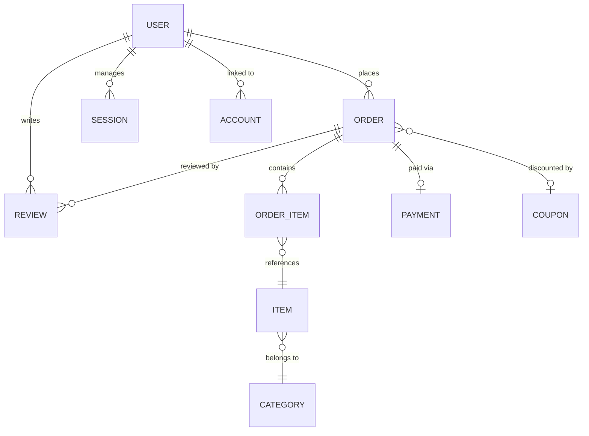

# 🍿 Urban Snacks Server (E-Commerce API)

[](https://nodejs.org/)
[](https://expressjs.com/)
[](https://www.postgresql.org/)
[](https://www.prisma.io/)
[](https://better-auth.com/)
[](https://stripe.com/)
[](https://www.sslcommerz.com/)
[](https://www.typescriptlang.org/)

The backend engine of **Urban Snacks** — a premium Bangladeshi snack e-commerce platform. This server handles secure authentication (including Google OAuth), full order lifecycle management with multi-gateway payments (Stripe + SSLCommerz), coupon & discount systems, dynamic banner management, and granular role-based access control.

---

## 📖 Table of Contents

1. [Technical Core](#-technical-core)
2. [Database Architecture](#️-database-architecture)
3. [Modular System Design](#️-modular-system-design)
4. [Security & Authentication](#-security--authentication)
5. [Payment Infrastructure](#-payment-infrastructure)
6. [Key API Modules](#-key-api-modules)
7. [Setup & Deployment](#️-setup--deployment)

---

## 🚀 Technical Core

- **Runtime**: Node.js 20+ with ES Modules (`"type": "module"`).
- **Engine**: Express 5 (Next Generation) for high-performance routing and native async error propagation.
- **ORM**: Prisma 7 with `@prisma/adapter-pg` for native PostgreSQL driver compatibility and multi-file schema support.
- **Authentication**: Better Auth with session-based flows, email/password, and Google OAuth 2.0.
- **Payments**: Dual payment gateway architecture — **Stripe** (international) + **SSLCommerz** (local Bangladesh).
- **Validation**: Zod 4 for runtime schema validation on all incoming request payloads.
- **Error Handling**: Centralized global error handler, async wrapper, request logger, and a 404 not-found middleware for clean, boilerplate-free controllers.
- **Build**: `tsup` for optimized TypeScript compilation + `tsx` for lightning-fast dev watch mode.

---

## 🗄️ Database Architecture

The system uses a relational PostgreSQL schema with **multi-file Prisma organization** — each domain entity lives in its own `.prisma` file for maximum clarity.

### Entities & Relationships

- **Users**: Extended with custom roles (`USER`, `ADMIN`) and status (`ACTIVE`, `INACTIVE`, `BANNED`). Supports soft-delete.
- **Items**: Product catalog with multi-image galleries, weight, pack size, spicy flags, featured status, and category linkage.
- **Categories**: Taxonomy model for classifying snack items, with featured flags and optional images.
- **Orders**: Full lifecycle tracking (`PLACED → PROCESSING → SHIPPED → DELIVERED` or `CANCELLED`) with delivery charges, discount logic, and coupon association.
- **OrderItems**: Junction table linking orders to items with unit pricing and quantity.
- **Payments**: Records transaction data for Stripe and SSLCommerz, including gateway metadata and invoice URLs.
- **Reviews**: Order-locked entities validated by a unique `[orderId, customerId]` constraint — one review per order.
- **Coupons**: Promotional codes with fixed/percentage discounts, minimum order thresholds, usage limits, and expiry dates.
- **Banners**: Dynamic hero slider content with ordering, category linking, and admin toggle.



### Enumerations

| Enum | Values |
|------|--------|
| `UserRole` | `USER`, `ADMIN` |
| `UserStatus` | `ACTIVE`, `INACTIVE`, `BANNED` |
| `OrderStatus` | `PLACED`, `PROCESSING`, `SHIPPED`, `DELIVERED`, `CANCELLED` |
| `PaymentStatus` | `PAID`, `UNPAID` |
| `DiscountType` | `FIXED`, `PERCENTAGE` |

### Schema Files

| File | Entities |
|------|----------|
| `auth.prisma` | `User`, `Session`, `Account`, `Verification` |
| `snack.prisma` | `Category`, `Item` |
| `order.prisma` | `Order`, `OrderItem`, `Payment`, `Coupon` |
| `review.prisma` | `Review` |
| `banner.prisma` | `Banner` |

---

## 🛠️ Modular System Design

The codebase follows a **Module-Based Pattern** (Domain-Driven) to enforce clear separation of concerns. Each module contains its own route, controller, service, types, and constants:

```text
src/
├── config/             # Environment variable validation & app config
├── constants/          # Global enums and magic values
├── generated/          # Prisma-generated client & enum exports
├── interfaces/         # Shared TypeScript interfaces
├── lib/                # Auth SDK initialization (Better Auth config)
├── middlewares/        # Auth RBAC guard, async handler, logger, error handler, 404
├── modules/            # Core Business Logic (Domain Driven)
│   ├── banner/         # Dynamic hero slider management
│   ├── category/       # Snack category taxonomy
│   ├── coupon/         # Promotional code engine
│   ├── item/           # Product catalog CRUD
│   ├── order/          # Order lifecycle (create, cancel, status flow)
│   ├── payment/        # Stripe + SSLCommerz gateway handlers
│   ├── review/         # Customer feedback & ratings
│   ├── stats/          # Admin analytics & dashboard KPIs
│   └── user/           # User management & status control
├── types/              # Express request augmentations
├── utils/              # Shared utility functions
├── app.ts              # Express app setup (CORS, auth, routes, error handling)
└── server.ts           # Entry point (port binding)
```

### Module Internal Pattern

Each module follows a consistent 4-file structure:

```text
module/
├── module.route.ts       # Express router with auth guards
├── module.controller.ts  # Request parsing & response formatting
├── module.service.ts     # Core business logic & Prisma queries
└── module.type.ts        # Module-specific TypeScript types
```

---

## 🔐 Security & Authentication

- **Better Auth**: Enterprise-grade session management with email/password and **Google OAuth 2.0** social login.
- **RBAC Middleware**: A `requireAuth(UserRole.ADMIN, UserRole.USER, ...)` middleware enforces role-based route-level protection. Routes are guarded at the handler level — unauthorized requests are rejected before any business logic executes.
- **Soft Delete**: All critical entities (Users, Items, Orders, Payments, Categories, Coupons) implement soft-delete with `isDeleted` + `deletedAt` columns for full auditability.
- **Vercel Proxy Trust**: `app.set("trust proxy", 1)` ensures secure cookie forwarding in serverless deployments.
- **CORS Guard**: Only configured origins (`APP_ORIGIN` + `PROD_APP_ORIGIN`) are permitted to make credentialed cross-origin requests.
- **Webhook Security**: Stripe webhooks are validated with raw body parsing on a dedicated `/webhook` endpoint registered before any JSON middleware.

---

## 💳 Payment Infrastructure

Urban Snacks supports a **dual payment gateway** architecture to serve both local and international customers:

### Stripe (International)

- **Checkout Sessions**: Server-generated Stripe Checkout sessions redirect users to Stripe-hosted payment pages.
- **Webhooks**: A `/webhook` endpoint listens for `checkout.session.completed` events to automatically mark orders as paid and record transaction IDs.

### SSLCommerz (Local — Bangladesh)

- **Session Initiation**: Generates SSLCommerz payment sessions with order metadata.
- **IPN Callbacks**: Handles `/ssl-success`, `/ssl-fail`, and `/ssl-cancel` endpoints for payment status resolution.

### Additional Payment Flows

- **Cash on Delivery (COD)**: Orders placed without online payment, tracked as `UNPAID` until manual confirmation.
- **Manual Orders**: Admin-created orders with a direct `PAID`/`UNPAID` status toggle.

---

## 📡 Key API Modules

> Base path for all custom routes: `/api/v1`
> Auth routes managed by Better Auth: `/api/auth/*`

### 🍿 Item Management

| Method | Endpoint | Access | Description |
|--------|----------|--------|-------------|
| `GET` | `/items` | Public | Browse all snack items (with pagination & filters) |
| `GET` | `/items/:id` | Public | Get a single item with full details |
| `POST` | `/items` | Admin | Add a new snack product |
| `PATCH` | `/items/:id` | Admin | Update item details, images, pricing |
| `DELETE` | `/items/:id` | Admin | Soft-delete an item |

### 📦 Order Management

| Method | Endpoint | Access | Description |
|--------|----------|--------|-------------|
| `POST` | `/orders` | User, Admin | Place a new order |
| `GET` | `/orders/all` | Admin | List all platform orders |
| `GET` | `/orders/my-orders` | User, Admin | Current user's order history |
| `GET` | `/orders/:orderId` | Authenticated | Get a single order with items |
| `PATCH` | `/orders/cancel/:orderId` | User, Admin | Cancel a pending order |
| `PATCH` | `/orders/change-status/:orderId` | Admin | Advance order through status flow |
| `PATCH` | `/orders/update-payment-method/:orderId` | User, Admin | Switch payment method |
| `DELETE` | `/orders/:orderId` | Admin | Soft-delete an order |

### 💳 Payment Processing

| Method | Endpoint | Access | Description |
|--------|----------|--------|-------------|
| `POST` | `/payments/create-checkout-session/:orderId` | User, Admin | Generate Stripe checkout session |
| `POST` | `/payments/initiate-ssl/:orderId` | User, Admin | Initiate SSLCommerz payment |
| `POST` | `/payments/ssl-success` | Public (IPN) | SSLCommerz success callback |
| `POST` | `/payments/ssl-fail` | Public (IPN) | SSLCommerz failure callback |
| `POST` | `/payments/ssl-cancel` | Public (IPN) | SSLCommerz cancellation callback |
| `GET` | `/payments/all` | Admin | View all payment records |
| `GET` | `/payments/order/:orderId` | User, Admin | Get payment by order |

### 🗂️ Categories

| Method | Endpoint | Access | Description |
|--------|----------|--------|-------------|
| `GET` | `/categories` | Public | List all snack categories |
| `POST` | `/categories` | Admin | Create a new category |
| `PATCH` | `/categories/:id` | Admin | Update a category |
| `DELETE` | `/categories/:id` | Admin | Delete a category |

### ⭐ Reviews

| Method | Endpoint | Access | Description |
|--------|----------|--------|-------------|
| `GET` | `/reviews` | Public | Retrieve all approved reviews |
| `GET` | `/reviews/:id` | Public | Get a single review |
| `POST` | `/reviews` | Authenticated | Submit a post-order review |
| `PATCH` | `/reviews/:id` | Authenticated | Update own review |
| `PATCH` | `/reviews/:id/status` | Admin | Approve or reject a review |
| `DELETE` | `/reviews/:id` | Authenticated | Delete own review |

### 🎟️ Coupons

| Method | Endpoint | Access | Description |
|--------|----------|--------|-------------|
| `GET` | `/coupons/verify/:code` | User, Admin | Validate and calculate coupon discount |
| `POST` | `/coupons` | Admin | Create a new coupon |
| `GET` | `/coupons` | Admin | List all coupons |
| `GET` | `/coupons/:id` | Admin | Get coupon details |
| `PATCH` | `/coupons/:id` | Admin | Update a coupon |
| `DELETE` | `/coupons/:id` | Admin | Delete a coupon |

### 🖼️ Banners

| Method | Endpoint | Access | Description |
|--------|----------|--------|-------------|
| `GET` | `/banners` | Public | Fetch active hero banners |
| `POST` | `/banners` | Admin | Create a new banner |
| `GET` | `/banners/:id` | Admin | Get a single banner |
| `PATCH` | `/banners/:id` | Admin | Update banner content |
| `DELETE` | `/banners/:id` | Admin | Remove a banner |

### 👤 User Management

| Method | Endpoint | Access | Description |
|--------|----------|--------|-------------|
| `GET` | `/users` | Admin | View all platform users |
| `PATCH` | `/users/status/:id` | Admin | Ban, activate, or deactivate accounts |

### 📊 Analytics

| Method | Endpoint | Access | Description |
|--------|----------|--------|-------------|
| `GET` | `/stats/admin` | Admin | Dashboard KPIs — revenue, orders, users, 30-day performance |

---

## 🛠️ Setup & Deployment

### Prerequisites

- **Node.js** v20+
- **pnpm** (recommended) or npm
- A PostgreSQL database (e.g., [Neon](https://neon.tech))
- Stripe account for payment processing
- SSLCommerz sandbox/live credentials

### Environment Configuration

Create a `.env` file using the template below:

```env
# Server
NODE_ENV=development
PORT=5001

# Frontend Origins
APP_ORIGIN="http://localhost:3000"
PROD_APP_ORIGIN="https://your-production-domain.com"

# Database
DATABASE_URL="your_postgresql_connection_string"

# Better Auth
BETTER_AUTH_SECRET="your_generated_secret"
BETTER_AUTH_URL="http://localhost:5001"

# Admin Seed Credentials
APP_ADMIN="Admin"
APP_ADMIN_EMAIL="admin@example.com"
APP_ADMIN_PASS="secure_password"

# Stripe
STRIPE_SECRET_KEY="sk_test_..."
STRIPE_WEBHOOK_SECRET="whsec_..."

# Google OAuth
GOOGLE_CLIENT_ID="your_google_client_id"
GOOGLE_CLIENT_SECRET="your_google_client_secret"

# SSLCommerz
SSL_STORE_ID="your_store_id"
SSL_STORE_PASSWD="your_store_password"
SSL_IS_SANDBOX=true
```

### Quick Commands

```bash
pnpm install              # Install dependencies
npx prisma generate       # Generate Prisma Client from multi-file schema
npx prisma migrate dev    # Apply DB migrations in development
pnpm run admin:seed       # Seed the initial system administrator
pnpm run dev              # Start dev server with tsx watch mode
pnpm run build            # Generate client + compile with tsup (production)

# Stripe local webhook forwarding
pnpm run stripe:webhook   # stripe listen --forward-to localhost:5001/webhook
```

### Deployment (Vercel)

The project is configured for serverless deployment on Vercel:

- `trust proxy` is pre-configured for secure session cookies behind Vercel's edge network.
- Multi-origin CORS support for staging and production frontends.
- `postinstall` script automatically generates the Prisma client on deploy.

---

**Built for scalability, security, and the love of snacks. 🍿**
