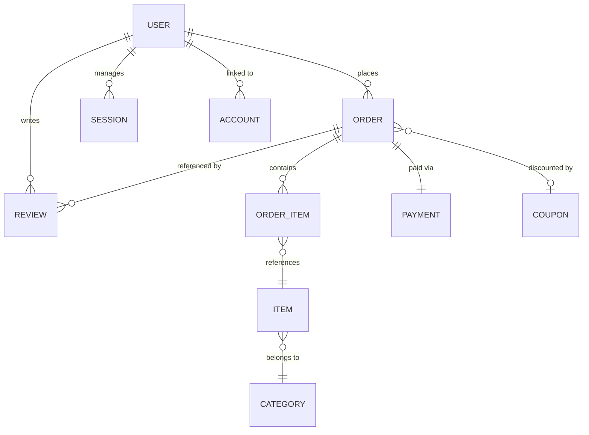

# 🍿 Urban Snacks Server (E-Commerce API)

[](https://nodejs.org/)
[](https://expressjs.com/)
[](https://www.postgresql.org/)
[](https://www.prisma.io/)
[](https://better-auth.com/)
[](https://www.typescriptlang.org/)
[](https://stripe.com/)
[](https://www.sslcommerz.com/)
[](https://zod.dev/)
[](https://vercel.com/)

The backend engine of **Urban Snacks** — a premium e-commerce platform for curated snack collections. This server powers secure authentication (including Google OAuth), multi-gateway payment processing (Stripe + SSLCommerz), transactional order lifecycle management, a dynamic coupon system, banner management, and granular role-based access control (RBAC).

---

## 📖 Table of Contents

1. [Technical Core](#-technical-core)
2. [Database Architecture](#-database-architecture)
3. [Modular System Design](#-modular-system-design)
4. [Security & Authentication](#-security--authentication)
5. [Key API Modules](#-key-api-modules)
6. [Payment Integrations](#-payment-integrations)
7. [Advanced Query Engine](#-advanced-query-engine)
8. [Setup & Deployment](#-setup--deployment)

---

## 🚀 Technical Core

- **Runtime**: Node.js 20+ with ES Modules (`"type": "module"`).
- **Engine**: Express 5 (Next Generation) for high-performance routing and native async error propagation.
- **ORM**: Prisma 7 with `@prisma/adapter-pg` for native PostgreSQL driver compatibility and multi-file schema support.
- **Authentication**: Better Auth with session-based flows, email/password, and Google OAuth 2.0 via `oAuthProxy` plugin.
- **Validation**: Zod for runtime schema validation and type-safe request parsing.
- **Payments**: Dual gateway support — **Stripe** (webhook-driven) and **SSLCommerz** (redirect-based).
- **Error Handling**: Centralized global error handler with Prisma-aware error classification (P2002, P2025, etc.) and a 404 not-found middleware for clean, boilerplate-free controllers.
- **Build**: `tsup` for optimized TypeScript compilation to ESM (`.mjs`) + `tsx` for lightning-fast dev watch mode.

---

## 🗄️ Database Architecture

The system uses a relational PostgreSQL schema (multi-file Prisma schema) designed for data integrity, soft-deletion auditability, and complex e-commerce workflows.

### Entities & Relationships

- **Users**: Extended with custom roles (`USER`, `ADMIN`) and status (`ACTIVE`, `INACTIVE`, `BANNED`). Soft-deletable.
- **Items**: Product catalog with multi-image galleries (`image[]`), `mainImage`, `semiTitle`, weight-based pricing, spicy flags, and category association.
- **Categories**: Taxonomy model with featured flags and optional sub-names for product classification.
- **Orders**: Full lifecycle management with shipping details, delivery charges, discount tracking, coupon linking, and cancel reason support.
- **Order Items**: Join entity connecting Orders and Items with unit pricing and subtotal snapshots.
- **Payments**: Multi-gateway transaction records supporting Stripe event IDs, SSLCommerz transaction IDs, and gateway metadata (JSON).
- **Reviews**: Order-locked entities validated by a unique `[orderId, customerId]` constraint ensuring one review per order.
- **Coupons**: Flexible discount system supporting `FIXED` and `PERCENTAGE` types, usage limits, min order amount, max discount caps, and expiry dates.
- **Banners**: Dynamic hero section management with optional titles, subtitles, badges, button text, category linking, and ordering.



### Enumerations

| Enum | Values |
|------|--------|
| `UserRole` | `USER`, `ADMIN` |
| `UserStatus` | `ACTIVE`, `INACTIVE`, `BANNED` |
| `OrderStatus` | `PLACED`, `PROCESSING`, `SHIPPED`, `DELIVERED`, `CANCELLED` |
| `PaymentStatus` | `PAID`, `UNPAID` |
| `DiscountType` | `FIXED`, `PERCENTAGE` |

---

## 🛠️ Modular System Design

The codebase follows a **Module-Based Pattern** (Domain-Driven) to prevent technical debt and enforce clear separation of concerns:

```text
src/
├── config/             # Environment variables (Zod-validated) & Stripe config
├── constants/          # Currency and app-wide constants
├── generated/          # Prisma Client auto-generated output
├── interfaces/         # TypeScript interfaces for query system
├── lib/                # Auth SDK initialization (Better Auth) & Prisma client
├── middlewares/        # Auth RBAC guard, async handler, logger, global error handler, 404 handler
├── modules/            # Core Business Logic (Domain Driven)
│   ├── banner/         # Hero banner CRUD management
│   ├── category/       # Product taxonomy management
│   ├── coupon/         # Discount coupon lifecycle (create, verify, redeem)
│   ├── item/           # Product catalog CRUD with multi-image support
│   ├── order/          # Order lifecycle (create, cancel, status transitions)
│   ├── payment/        # Multi-gateway payment processing (Stripe + SSLCommerz)
│   ├── review/         # Customer feedback and rating system
│   ├── stats/          # Admin dashboard analytics (30-day performance)
│   └── user/           # User management and status control
├── types/              # Express request augmentation (IUser)
├── utils/              # QueryBuilder engine & pagination utilities
├── app.ts              # Express app setup (CORS, auth, routes, webhooks, error handling)
├── index.ts            # Vercel serverless entry point
└── server.ts           # Local development entry point (port binding)

prisma/
├── schema/             # Multi-file Prisma schema
│   ├── schema.prisma   # Generator & datasource config
│   ├── auth.prisma     # User, Session, Account, Verification models
│   ├── snack.prisma    # Category & Item models
│   ├── order.prisma    # Order, OrderItem, Payment, Coupon models
│   ├── review.prisma   # Review model
│   └── banner.prisma   # Banner model
├── migrations/         # Database migration history
└── seed/               # Admin seed script
```

---

## 🔐 Security & Authentication

- **Better Auth**: Enterprise-grade session management with email/password and **Google OAuth 2.0** social login via `oAuthProxy` plugin.
- **Cookie Security**: Secure HTTP-only cookies with `sameSite: "lax"`, custom `urban_snacks` prefix, and production-only `secure` flag.
- **Session Caching**: Cookie cache enabled with a 3-day TTL for reduced database lookups.
- **RBAC Middleware**: A `requireAuth(UserRole.ADMIN, UserRole.USER, ...)` middleware enforces role-based route-level protection. Routes are guarded at the handler level — unauthorized requests are rejected before any business logic runs.
- **Ban Enforcement**: Dual-layer ban checking — both at session creation (database hook) and at middleware level — ensures banned users cannot access any protected resource.
- **Sign-up Hardening**: Auth hooks block admin role self-assignment and invalid initial status (`BANNED`, `INACTIVE`) during registration.
- **Stripe Webhook Verification**: Raw body parsing for `/webhook` endpoint ensures cryptographic signature validation of Stripe events.
- **Vercel Proxy Trust**: `app.set("trust proxy", 1)` ensures secure cookie forwarding in serverless deployments.
- **CORS Guard**: Only configured origins (`APP_ORIGIN`, `PROD_APP_ORIGIN`) are permitted to make credentialed cross-origin requests.

---

## 📡 Key API Modules

> Base path for all custom routes: `/api/v1`  
> Auth routes managed by Better Auth: `/api/auth/*`  
> Stripe webhook: `/webhook`

### 🍕 Item Management

| Method | Endpoint | Access | Description |
|--------|----------|--------|-------------|
| `GET` | `/items` | Public | Browse all items (search, filter, paginate) |
| `GET` | `/items/:id` | Public | Get a single item with full details |
| `POST` | `/items` | Admin | Create a new product listing |
| `PATCH` | `/items/:id` | Admin | Update item details, images, or pricing |
| `DELETE` | `/items/:id` | Admin | Soft-delete an item |

### 🗂️ Category Management

| Method | Endpoint | Access | Description |
|--------|----------|--------|-------------|
| `GET` | `/categories` | Public | List all categories |
| `POST` | `/categories` | Admin | Create a new product category |
| `PATCH` | `/categories/:id` | Admin | Update category details |
| `DELETE` | `/categories/:id` | Admin | Soft-delete a category |

### 📦 Order Management

| Method | Endpoint | Access | Description |
|--------|----------|--------|-------------|
| `POST` | `/orders` | User, Admin | Place a new order with shipping details |
| `GET` | `/orders/all` | Admin | List all orders (admin view) |
| `GET` | `/orders/my-orders` | User, Admin | Get the current user's order history |
| `GET` | `/orders/:orderId` | Authenticated | Get a single order with full details |
| `PATCH` | `/orders/cancel/:orderId` | User, Admin | Cancel an order with reason |
| `PATCH` | `/orders/change-status/:orderId` | Admin | Transition order status (process, ship, deliver) |
| `PATCH` | `/orders/update-payment-method/:orderId` | User, Admin | Change payment method on an order |
| `DELETE` | `/orders/:orderId` | Admin | Soft-delete an order |

### 💳 Payment Processing

| Method | Endpoint | Access | Description |
|--------|----------|--------|-------------|
| `POST` | `/payments/create-checkout-session/:orderId` | User, Admin | Create a Stripe Checkout session |
| `POST` | `/payments/initiate-ssl/:orderId` | User, Admin | Initiate SSLCommerz payment |
| `POST` | `/payments/ssl-success` | Public (callback) | SSLCommerz success callback |
| `POST` | `/payments/ssl-fail` | Public (callback) | SSLCommerz failure callback |
| `POST` | `/payments/ssl-cancel` | Public (callback) | SSLCommerz cancellation callback |
| `GET` | `/payments/all` | Admin | List all payment transactions |
| `GET` | `/payments/order/:orderId` | User, Admin | Get payment details for an order |
| `POST` | `/webhook` | Stripe (signature verified) | Handle Stripe webhook events |

### ⭐ Reviews

| Method | Endpoint | Access | Description |
|--------|----------|--------|-------------|
| `GET` | `/reviews` | Public | Retrieve all reviews |
| `GET` | `/reviews/:id` | Public | Get a single review |
| `POST` | `/reviews` | Authenticated | Submit a post-order review |
| `PATCH` | `/reviews/:id` | Authenticated | Update own review |
| `PATCH` | `/reviews/:id/status` | Admin | Approve or reject a review |
| `DELETE` | `/reviews/:id` | Authenticated | Delete own review |

### 🎟️ Coupon Management

| Method | Endpoint | Access | Description |
|--------|----------|--------|-------------|
| `GET` | `/coupons/verify/:code` | User, Admin | Verify and validate a coupon code |
| `POST` | `/coupons` | Admin | Create a new discount coupon |
| `GET` | `/coupons` | Admin | List all coupons |
| `GET` | `/coupons/:id` | Admin | Get a single coupon |
| `PATCH` | `/coupons/:id` | Admin | Update coupon details |
| `DELETE` | `/coupons/:id` | Admin | Soft-delete a coupon |

### 🖼️ Banner Management

| Method | Endpoint | Access | Description |
|--------|----------|--------|-------------|
| `GET` | `/banners` | Public | Fetch active banners for the hero slider |
| `POST` | `/banners` | Admin | Create a new hero banner |
| `GET` | `/banners/:id` | Admin | Get a single banner |
| `PATCH` | `/banners/:id` | Admin | Update banner content or ordering |
| `DELETE` | `/banners/:id` | Admin | Soft-delete a banner |

### 👥 User Management

| Method | Endpoint | Access | Description |
|--------|----------|--------|-------------|
| `GET` | `/users` | Admin | View all platform users |
| `PATCH` | `/users/status/:id` | Admin | Ban, activate, or deactivate accounts |

### 📊 Admin Statistics

| Method | Endpoint | Access | Description |
|--------|----------|--------|-------------|
| `GET` | `/stats/admin` | Admin | Full platform analytics dashboard |

> **Stats include**: Total items, orders, payments, revenue, reviews, users, categories, coupons, banners · Order status breakdown · Payment method distribution · Top 5 most ordered items · 30-day revenue performance chart · Recent orders feed

---

## 💰 Payment Integrations

### Stripe

- **Flow**: Server-side Checkout Session creation → Client redirect → Webhook confirmation.
- **Webhook**: Raw body parsing at `/webhook` with cryptographic signature verification via `stripe.webhooks.constructEvent`.
- **Local Testing**: `stripe listen --forward-to localhost:5001/webhook` for local webhook forwarding.

### SSLCommerz

- **Flow**: Server-side session initiation → Client redirect to SSLCommerz gateway → IPN callback to success/fail/cancel endpoints.
- **Sandbox Mode**: Configurable via `SSL_IS_SANDBOX` environment variable for development testing.

---

## ⚙️ Advanced Query Engine

The server includes a powerful, reusable `QueryBuilder` class that provides:

- 🔍 **Full-Text Search**: Case-insensitive search across configurable fields, including nested relations.
- 🎛️ **Dynamic Filtering**: Supports flat fields, dot-notation relation fields (`category.name`), range operators (`gt`, `gte`, `lt`, `lte`), and boolean/number auto-parsing.
- 📄 **Pagination**: Configurable `page` and `limit` with automatic `totalPage` calculation.
- 🔃 **Sorting**: Multi-level sorting support including nested relation fields (`category.name`).
- 📌 **Field Selection**: Comma-separated field projection (`?fields=name,price`).
- 🔗 **Relation Includes**: Dynamic relation loading with `hasMany`/`hasOne` awareness.
- 🚫 **Omit Fields**: Exclude sensitive fields from responses.

```typescript
// Example usage
const result = await new QueryBuilder(prisma.item, req.query, {
  searchableFields: ["name", "category.name"],
  filterableFields: ["categoryId", "isActive", "isFeatured"],
})
  .search()
  .filter()
  .where({ isDeleted: false })
  .include({ category: true })
  .sort()
  .paginate()
  .execute();
```

---

## 🛠️ Setup & Deployment

### Prerequisites

- Node.js 20+
- pnpm (recommended) or npm
- PostgreSQL database (Neon, Supabase, or local)
- Stripe account (for payment processing)
- SSLCommerz account (for local gateway — optional)

### Environment Configuration

Create a `.env` file using the template below:

```env
# Server
NODE_ENV=development
PORT=5001

# Frontend Origins
APP_ORIGIN="http://localhost:3000"
PROD_APP_ORIGIN="https://your-production-frontend.vercel.app"

# Database
DATABASE_URL="your_postgresql_connection_string"

# Better Auth
BETTER_AUTH_SECRET="your_generated_secret"
BETTER_AUTH_URL="http://localhost:5001"

# Admin Seed Credentials
APP_ADMIN="Admin"
APP_ADMIN_EMAIL="admin@urbansnacks.com"
APP_ADMIN_PASS="secure_password"

# Stripe
STRIPE_SECRET_KEY="sk_test_..."
STRIPE_WEBHOOK_SECRET="whsec_..."

# Google OAuth
GOOGLE_CLIENT_ID="your_google_client_id"
GOOGLE_CLIENT_SECRET="your_google_client_secret"

# SSLCommerz
SSL_STORE_ID="your_ssl_store_id"
SSL_STORE_PASSWD="your_ssl_store_password"
SSL_IS_SANDBOX=true
```

### Quick Commands

```bash
pnpm install                # Install dependencies
npx prisma generate         # Generate Prisma Client from multi-file schema
npx prisma migrate dev      # Apply DB migrations in development
pnpm run admin:seed         # Seed the initial system administrator
pnpm run dev                # Start dev server with tsx watch mode
pnpm run build              # Generate client + compile with tsup (production)
pnpm run stripe:webhook     # Forward Stripe webhooks locally
npx prisma studio           # Open Prisma Studio for visual DB management
```

### Deployment (Vercel)

The project ships with a `vercel.json` configuration and an `api/` entry point for serverless deployment:

1. **Build Output**: `tsup` compiles to `api/index.mjs` — a single ESM serverless function.
2. **Routing**: All incoming requests are routed to `/api/index.mjs` via Vercel rewrites.
3. **Trust Proxy**: Pre-configured for secure session cookies behind Vercel's edge network.
4. **Post-install**: `prisma generate` runs automatically via the `postinstall` script.

```json
{
  "version": 2,
  "builds": [{ "src": "api/index.mjs", "use": "@vercel/node" }],
  "routes": [{ "src": "/(.*)", "dest": "/api/index.mjs" }]
}
```

---

## 📂 Tech Stack Summary

| Layer | Technology |
|-------|-----------|
| Runtime | Node.js 20+ (ESM) |
| Framework | Express 5 |
| Language | TypeScript 5 |
| ORM | Prisma 7 (Multi-file Schema) |
| Database | PostgreSQL (Neon) |
| Authentication | Better Auth + Google OAuth 2.0 |
| Payments | Stripe + SSLCommerz |
| Validation | Zod 4 |
| Build Tool | tsup |
| Dev Server | tsx (watch mode) |
| Deployment | Vercel (Serverless) |
| Package Manager | pnpm |

---

<div align="center">

**Built with precision for scalability, security, and premium snack delivery.** 🍿

</div>
